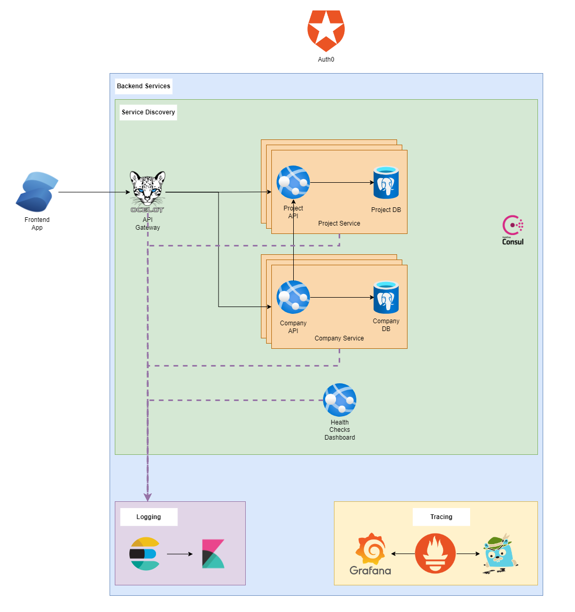

# Nexus.Logs

Note: This content is outdated and needs to be updated.



## Configuration

Ensure the following settings exist in appsettings.json / Environment variables / Consul KV:

```json
{
  "SerilogSettings": {
    "ElasticSearchSettings": {
      "Uri": "https://localhost:9200",
      "Username": "<elastic-username>",
      "Password": "<elastic-password>",
      "IndexFormat": "logs-<service-name>-{0:yyyy.MM}"
    }
  },
  "Serilog": {
    "MinimumLevel": {
      "Default": "Verbose",
      "Override": {
        "Microsoft": "Warning",
        "System": "Warning"
      }
    }
  }
}
```

## Usage

While building the `WebApplication`, call:

```
WebApplicationBuilder builder = WebApplication.CreateBuilder(args);
builder.Logging.AddCoreLogging(builder.Configuration);
```